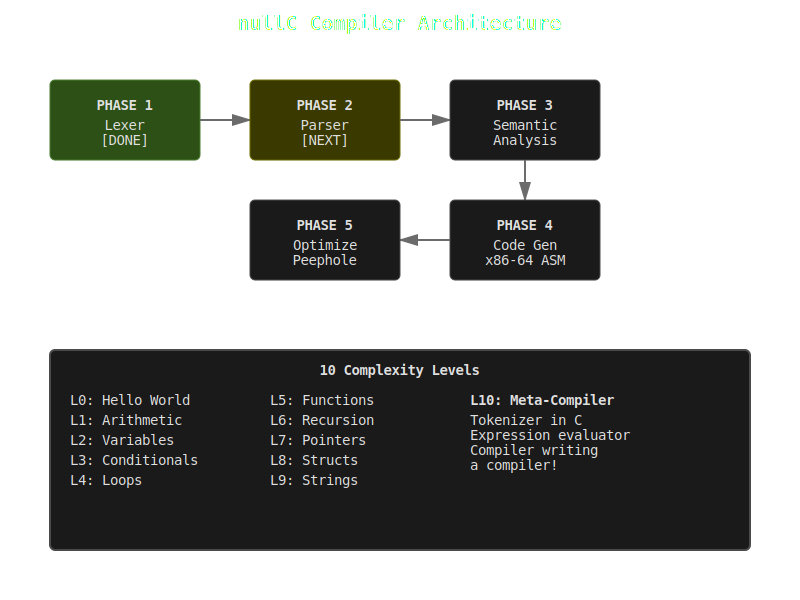

# nullC

A minimal C compiler written in C. Educational project.



## Status
**Working:** Lexer, parser, codegen all functional

**Test Results (ARM64):**
- ✓ Level 0-10: All levels passing (structs with nested members now working)

**Compilation Pipeline:**
C source → Lexer → Parser → AST → ARM64 Assembly → Binary

## Build
```bash
make
./nullc examples/level0_hello.c
./level0_hello  # Run compiled binary
echo $?         # Check exit code
```

## Test All Levels
```bash
for f in examples/level*.c; do
  ./nullc "$f" && ./${f%.c} && echo "Exit: $?"
done
```

## Documentation
- [ROADMAP.md](ROADMAP.md) - Development phases
- [CLAUDE.md](CLAUDE.md) - Development notes

## Author
Joshua Trommel (nulljosh)
